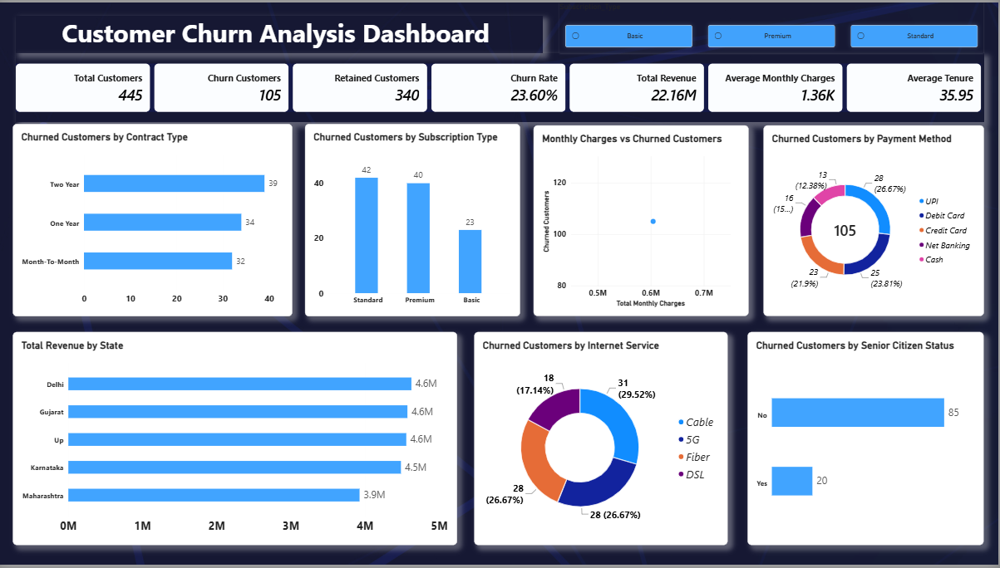

# Customer Churn Analysis | Python, MySQL & Power BI

An end-to-end data analytics project that takes a messy customer dataset from raw Excel to a cleaned dataset, SQL analysis, and an interactive Power BI dashboard to understand **why customers leave and who is most at risk**.

**Tech stack:** Python · Pandas · NumPy · Jupyter Notebook · MySQL · SQL · Power BI · DAX

---

## Dashboard Preview



---

## Business Problem

Customer churn directly reduces revenue, and keeping an existing customer is usually cheaper than acquiring a new one. This project answers questions a business team would ask:

- What is the overall churn rate, and how much revenue is involved?
- Does churn differ by **contract type**, **subscription plan**, or **payment method**?
- Which **internet services** and **customer segments** (e.g. senior citizens) show more churn?
- How do **monthly charges** and **tenure** relate to churn?
- Which **states** contribute the most revenue?

---

## Key Metrics (Power BI Dashboard)

| KPI | Value |
|---|---|
| Total Customers | 445 |
| Churned Customers | 105 |
| Retained Customers | 340 |
| **Churn Rate** | **23.60%** |
| Total Revenue | 22.16M |
| Average Monthly Charges | 1.36K |
| Average Tenure | 35.95 months |

---

## Workflow

```text
Raw Excel Data (.xlsx)
        ↓
Python / Jupyter Notebook  →  Data cleaning, validation, feature engineering
        ↓
Cleaned CSV
        ↓
MySQL (churndb.customer_churn)  →  SQL analysis
        ↓
Power BI  →  DAX measures + interactive dashboard
        ↓
Business insights
```

---

## 1. Data Cleaning (Python)

| | Rows | Columns |
|---|---|---|
| Raw dataset | 542 | 18 |
| After cleaning | 492 | 18 |
| After feature engineering | 492 | 23 |

**Cleaning steps performed with Pandas & NumPy:**

- Checked and handled missing values
- Removed duplicate records
- Replaced dirty / inconsistent values
- Removed extra spaces and standardized text (proper case)
- Standardized categorical values
- Validated age values and removed invalid negative charges
- Converted date fields and corrected data types
- Exported the cleaned dataset to CSV

---

## 2. Feature Engineering

| New Column | Logic | Purpose |
|---|---|---|
| `Customer_Value` | `Monthly_Charges × Tenure_Months` | Estimate value of each customer |
| `Monthly_Revenue` | `Monthly_Charges` | Revenue analysis |
| `Tenure_Group` | 0–12, 13–24, 25–48, 49–72 months | Compare churn across customer lifetime |
| `Senior_Flag` | Adult / Senior | Segment analysis |
| `Churn_Flag` | Yes = 1, No = 0 | Numeric churn indicator for calculations |

---

## 3. SQL Analysis (MySQL)

The cleaned data was loaded into MySQL:

```text
Database: churndb
Table:    customer_churn
```

SQL was used for filtering, grouping, and aggregation to analyze:

- Churn by contract type
- Churn by payment method
- Churn by internet service
- Revenue analysis
- Customer segment analysis

---

## 4. Power BI Dashboard & DAX

DAX measures were created for: **Total Customers, Churned Customers, Retained Customers, Churn Rate, Total Revenue, Average Monthly Charges, and Average Tenure.**

**Dashboard visuals:**

1. Churned customers by **Contract Type** (Month-to-Month, One Year, Two Year)
2. Churned customers by **Subscription Type** (Basic, Standard, Premium)
3. **Monthly Charges** vs Churned Customers
4. Churned customers by **Payment Method** (UPI, Debit Card, Credit Card, Net Banking, Cash)
5. **Total Revenue by State**
6. Churned customers by **Internet Service** (Cable, 5G, Fiber, DSL)
7. Churned customers by **Senior Citizen** status
8. **Subscription Type slicer** for interactive filtering

---

## Repository Structure

```text
Customer-Churn-Analysis-Power-BI/
│
├── README.md
├── Churn_Unclean_Project.xlsx              # Raw dataset
├── Clean_Churn_Data.csv                    # Cleaned dataset
├── Churn Dataset Cleaning.ipynb            # Python cleaning & feature engineering
├── Customer_Churn_Analysis_Dashboard.pbix  # Power BI dashboard
└── Customer_Churn_Dashboard.png            # Dashboard screenshot
```

---

## How to Run

1. Clone the repository.
2. Open `Churn Dataset Cleaning.ipynb` in Jupyter Notebook and run all cells (requires `pandas`, `numpy`).
3. Load `Clean_Churn_Data.csv` into MySQL (`churndb.customer_churn`) to run the SQL analysis.
4. Open `Customer_Churn_Analysis_Dashboard.pbix` in Power BI Desktop to explore the dashboard.

---

## Skills Demonstrated

- **Python:** data cleaning, transformation, feature engineering (Pandas, NumPy)
- **SQL / MySQL:** database setup, filtering, grouping, aggregation
- **Power BI & DAX:** KPI measures, interactive dashboards, slicers, filters
- **Analytics:** turning raw data into business insights

---

## Author

**Hemant Kumar Gavaria** — Aspiring Data Analyst

[LinkedIn](https://www.linkedin.com/in/hemantkumar-g) · [GitHub](https://github.com/Hemantkumar18)
